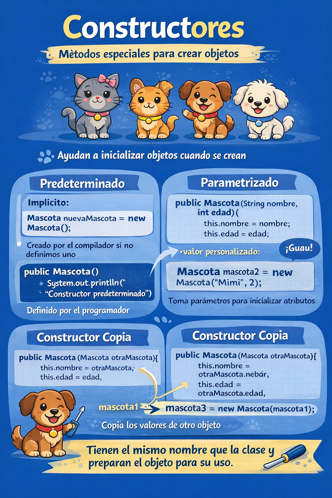

# Constructores



Un constructor inicializa el objeto al crearlo.

```java
// Constructor predeterminado explicito
Mascota() {
    System.out.println("Constructor predeterminado");
}
```

```java
// Constructor parametrizado
public Mascota(String nombre, int edad) {
    this.nombre = nombre;
    this.edad = edad;
    this.comiendo = false;
}
```

```java
// Constructor copia
public Mascota(Mascota otraMascota) {
    this.nombre = otraMascota.nombre;
    this.edad = otraMascota.edad;
    this.comiendo = otraMascota.comiendo;
}
```

> Nota: No es necesario escribir un constructor para una clase. El compilador de Java crea un constructor predeterminado (sin argumentos) si la clase no tiene ninguno.
