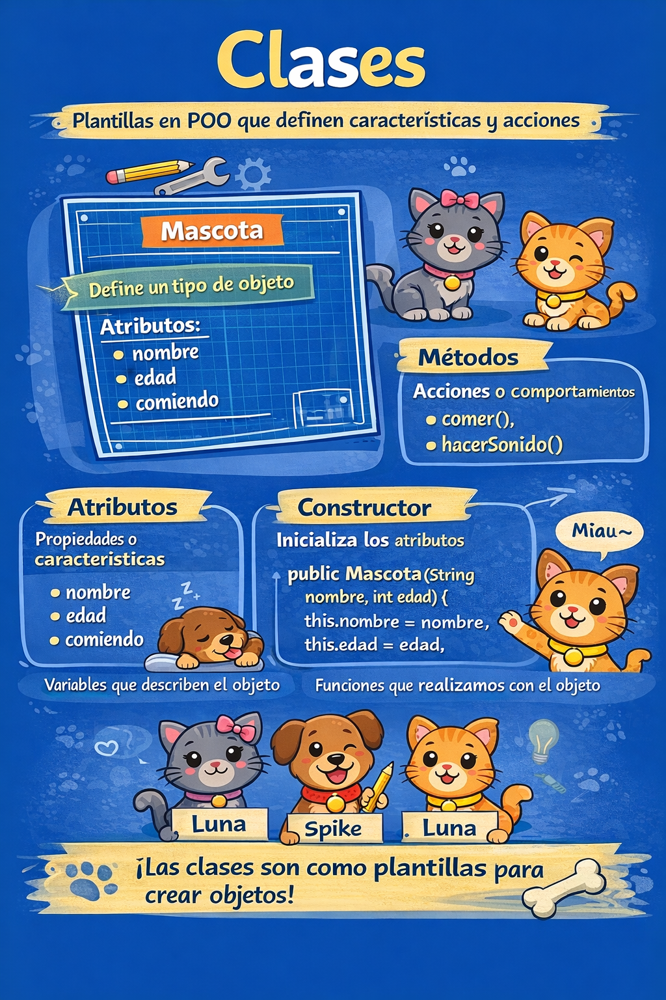

# Que es una clase



Una clase define:

- Atributos (caracteristicas)
- Metodos (acciones)
- Constructores
- Modificadores de acceso

```java
public class Mascota {
    String nombre;
    int edad;
    boolean comiendo;

    public void comer() {
        this.comiendo = true;
        System.out.println("Nam Nam Nam");
    }

    public void hacerSonido() {
        System.out.println("Woof!");
    }
}
```

## Abstraccion


Abstraer es modelar solo lo necesario del problema.
