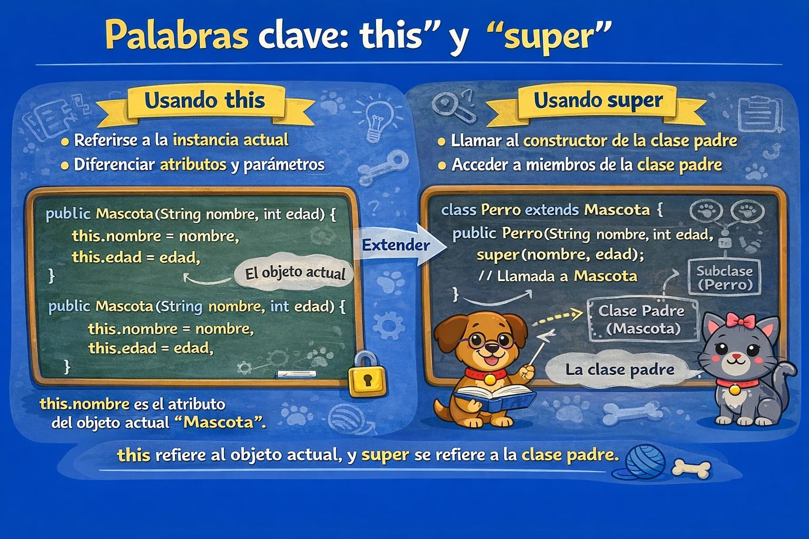

# Uso de this y super



- this: referencia al objeto actual.
- super: referencia a la superclase.

```java
// Superclase
public class Mascota {
    String nombre;
    int edad;
    boolean durmiendo;

    public Mascota(String nombre, int edad, boolean durmiendo) {
        this.nombre = nombre;
        this.edad = edad;
        this.durmiendo = durmiendo;
    }

    public void hacerSonido() {
        System.out.println("La mascota hace un sonido generico.");
    }
}

// Subclase
public class Perro extends Mascota {
    public Perro(String nombre, int edad, boolean durmiendo) {
        super(nombre, edad, durmiendo);
    }

    @Override
    public void hacerSonido() {
        super.hacerSonido();
        System.out.println("El perro ladra: Guau!");
    }
}
```